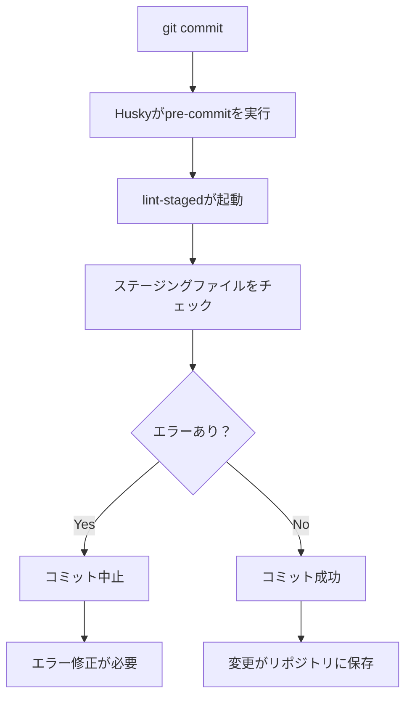

# 開発環境設定詳細ガイド

このドキュメントでは、Next.jsプロジェクトに設定されている開発環境の各種設定について詳細に説明します。

## 🚀 重要：コマンドの使い分け

### npm run format vs npm run lint

#### `npm run format`
**用途**: コードの**見た目・スタイル**を統一
```bash
npm run format        # 全ファイルをフォーマット
npm run format:check  # フォーマットチェックのみ（修正しない）
```

**実行内容**:
- Prettierでコードフォーマット
- インデント、改行、クォート、セミコロンなどの統一
- **エラー修正はしない**（見た目のみ）

#### `npm run lint`
**用途**: コードの**品質・エラー**をチェック
```bash
npm run lint      # エラーチェックのみ
npm run lint:fix  # エラーの自動修正も実行
```

**実行内容**:
- ESLintでコード品質チェック
- 未使用変数、型エラー、ベストプラクティス違反の検出
- `--fix`オプションで修正可能なエラーを自動修正

#### 使い分けガイド

| コマンド | 目的 | 修正 | 使用タイミング |
|----------|------|------|------------|
| `npm run format` | スタイル統一 | ✅ | コミット前、チーム開発時 |
| `npm run format:check` | スタイルチェック | ❌ | CI/CD、確認時 |
| `npm run lint` | 品質チェック | ❌ | エラー確認時 |
| `npm run lint:fix` | 品質+修正 | ✅ | **日常開発で推奨** |

#### 推奨ワークフロー

**日常開発**:
```bash
# 基本的にはこれだけでOK（lint + format両方実行）
npm run lint:fix
```

**コミット前**:
```bash
# 最終確認
npm run lint:fix && npm run format
```

**CI/CD**:
```bash
# チェックのみ（修正しない）
npm run lint && npm run format:check
```

#### 自動化設定

**VSCode（保存時自動実行）**:
- `source.fixAll: "always"` → `npm run lint:fix` 相当
- `editor.formatOnSave: true` → `npm run format` 相当

**Git Hooks（コミット時自動実行）**:
- Pre-commit → `eslint --fix` + `prettier --write` を自動実行

---

## 目次

1. [VSCode設定](#vscode設定)
2. [ESLint設定](#eslint設定)
3. [Prettier設定](#prettier設定)
4. [Husky設定（Git Hooks）](#husky設定git-hooks)
5. [lint-staged設定](#lint-staged設定)
6. [TypeScript設定](#typescript設定)
7. [EditorConfig設定](#editorconfig設定)
8. [推奨拡張機能](#推奨拡張機能)
9. [コードスニペット](#コードスニペット)

---

## VSCode設定

### ファイル: `.vscode/settings.json`

#### 基本エディタ設定
```json
{
  "editor.tabSize": 2,                    // タブサイズを2スペースに設定
  "editor.insertSpaces": true,            // タブの代わりにスペースを挿入
  "editor.formatOnSave": true,            // ファイル保存時に自動フォーマット
  "editor.formatOnPaste": false,          // ペースト時のフォーマットを無効化
  "editor.formatOnType": false            // 入力時のフォーマットを無効化
}
```

#### 保存時の自動アクション
```json
{
  "editor.codeActionsOnSave": {
    "source.fixAll": "always",            // ESLintエラーの自動修正
    "source.organizeImports": "always"    // import文の自動整理
  }
}
```

#### ファイル管理設定
```json
{
  "files.autoSave": "onFocusChange",      // フォーカスが外れた時に自動保存
  "files.exclude": {                      // エクスプローラーから除外するファイル
    "**/.next": true,
    "**/node_modules": true,
    "**/.git": true
  },
  "search.exclude": {                     // 検索から除外するファイル
    "**/node_modules": true,
    "**/.next": true,
    "**/.git": true
  }
}
```

#### ESLint統合設定
```json
{
  "eslint.enable": true,                  // ESLintを有効化
  "eslint.validate": [                    // ESLintで検証する言語
    "javascript",
    "javascriptreact",
    "typescript",
    "typescriptreact"
  ],
  "eslint.codeAction.showDocumentation": {
    "enable": true                        // ESLintルールのドキュメント表示
  },
  "eslint.codeActionsOnSave.mode": "all", // 保存時にすべてのESLint修正を実行
  "eslint.format.enable": false           // ESLintフォーマットを無効化（Prettierに任せる）
}
```

#### Prettier統合設定
```json
{
  "prettier.enable": true,                // Prettierを有効化
  "prettier.requireConfig": true,         // 設定ファイルが必要
  "editor.defaultFormatter": "esbenp.prettier-vscode",
  "[javascript]": {
    "editor.defaultFormatter": "esbenp.prettier-vscode"
  },
  "[javascriptreact]": {
    "editor.defaultFormatter": "esbenp.prettier-vscode"
  },
  "[typescript]": {
    "editor.defaultFormatter": "esbenp.prettier-vscode"
  },
  "[typescriptreact]": {
    "editor.defaultFormatter": "esbenp.prettier-vscode"
  },
  "[json]": {
    "editor.defaultFormatter": "esbenp.prettier-vscode"
  },
  "[css]": {
    "editor.defaultFormatter": "esbenp.prettier-vscode"
  }
}
```

#### TypeScript開発支援設定
```json
{
  "typescript.tsdk": "node_modules/typescript/lib",
  "typescript.preferences.includePackageJsonAutoImports": "auto",
  "typescript.suggest.autoImports": true,                    // 自動import提案
  "typescript.updateImportsOnFileMove.enabled": "always",   // ファイル移動時にimport更新
  "typescript.inlayHints.parameterNames.enabled": "all",    // パラメータ名ヒント表示
  "typescript.inlayHints.variableTypes.enabled": true,      // 変数型ヒント表示
  "typescript.inlayHints.functionLikeReturnTypes.enabled": true // 戻り値型ヒント表示
}
```

#### UI・UX設定
```json
{
  "editor.bracketPairColorization.enabled": true,  // ブラケットペアの色分け
  "editor.guides.bracketPairs": "active",          // アクティブなブラケットペアのガイド表示
  "editor.cursorBlinking": "smooth",               // スムーズなカーソル点滅
  "editor.cursorSmoothCaretAnimation": "on",       // スムーズなカーソル移動
  "workbench.tree.indent": 20,                     // ツリー表示のインデント
  "breadcrumbs.enabled": true,                     // パンくずリスト表示
  "explorer.compactFolders": false,                // フォルダーの圧縮表示を無効化
  "editor.minimap.enabled": false,                 // ミニマップを無効化
  "workbench.startupEditor": "none",               // 起動時にエディタを開かない
  "explorer.confirmDelete": false                  // ファイル削除時の確認を無効化
}
```

---

## ESLint設定

### ファイル: `eslint.config.mjs`

```javascript
import { FlatCompat } from '@eslint/eslintrc';
import { dirname } from 'path';
import { fileURLToPath } from 'url';

const __filename = fileURLToPath(import.meta.url);
const __dirname = dirname(__filename);

const compat = new FlatCompat({
  baseDirectory: __dirname,
});

const eslintConfig = [
  // Next.jsとTypeScriptの推奨ルールを適用
  ...compat.extends('next/core-web-vitals', 'next/typescript', 'prettier'),
  {
    rules: {
      // Import文の順序を自動整理
      'import/order': [
        'error',
        {
          groups: [
            ['builtin', 'external'],    // Node.js組み込み、外部ライブラリ
            'internal',                 // 内部モジュール
            ['parent', 'sibling'],      // 親・兄弟ディレクトリ
            'index'                     // indexファイル
          ],
          'newlines-between': 'always', // グループ間に空行を強制
          alphabetize: { 
            order: 'asc',               // アルファベット順にソート
            caseInsensitive: true       // 大文字小文字を区別しない
          },
        },
      ],
    },
  },
];

export default eslintConfig;
```

#### 適用されるルール
- **Next.js Core Web Vitals**: パフォーマンスとアクセシビリティの基本ルール
- **Next.js TypeScript**: TypeScript用の最適化ルール
- **Prettier統合**: PrettierとESLintの競合を回避
- **Import Order**: import文の自動整理とソート

---

## Prettier設定

### ファイル: `.prettierrc`

```json
{
  "semi": true,                    // 文末にセミコロンを追加
  "trailingComma": "es5",         // ES5で有効な箇所に末尾カンマを追加
  "singleQuote": true,            // JSではシングルクォートを使用
  "printWidth": 100,              // 1行の最大文字数
  "tabWidth": 2,                  // タブ幅を2スペースに設定
  "useTabs": false,               // タブの代わりにスペースを使用
  "endOfLine": "lf",              // 改行コードをLFに統一
  "bracketSpacing": true,         // オブジェクトリテラルの波括弧内にスペース
  "arrowParens": "avoid",         // アロー関数の引数が1つの場合は括弧を省略
  "jsxSingleQuote": false,        // JSX属性ではダブルクォートを使用
  "bracketSameLine": false        // JSXの閉じタグを新しい行に配置
}
```

### ファイル: `.prettierignore`

```
node_modules
.next
.git
dist
build
coverage
*.log
.env*
.DS_Store
.vscode
*.md
```

#### フォーマット対象外ファイル
- ビルド成果物（`.next`, `out`, `build`）
- 依存関係（`node_modules`）
- 手書きファイル（`*.md`）
- システムファイル（`.git`, `.DS_Store`）

---

## Husky設定（Git Hooks）

### Huskyとは？
**Husky**は、Gitのフック（Git Hooks）を簡単に設定・管理できるツールです。

#### Git Hooksって何？
Git Hooksは、Gitの特定のアクション（コミット、プッシュなど）が実行される前後に自動でスクリプトを実行する仕組みです。

#### なぜHuskyを使うの？
- **品質保証**: コミット前に自動でlintやテストを実行
- **チーム統一**: 全メンバーが同じルールでコミット
- **早期発見**: エラーを本番環境に送る前にキャッチ

### 利用可能なGit Hooks

| フック名 | タイミング | 用途例 |
|----------|------------|--------|
| `pre-commit` | コミット直前 | lint、format、テスト実行 |
| `commit-msg` | コミットメッセージ作成後 | メッセージ形式チェック |
| `pre-push` | プッシュ直前 | 統合テスト、ビルドチェック |
| `post-merge` | マージ後 | 依存関係の更新 |

### 現在の設定

#### セットアップファイル
```
.husky/
├── _/           # Huskyの内部ファイル
└── pre-commit   # pre-commitフックスクリプト
```

#### .husky/pre-commit の内容
```bash
npx lint-staged
```

### 動作の流れ



#### 詳細な動作
1. **開発者が `git commit` を実行**
2. **Huskyが `.husky/pre-commit` を自動実行**
3. **`npx lint-staged` が起動**
4. **ステージングされたファイルのみを対象に以下を実行**:
   - TypeScript/JavaScriptファイル: `eslint --fix` + `prettier --write`
   - その他ファイル: `prettier --write`
5. **エラーがある場合**: コミット中止、修正を促す
6. **エラーがない場合**: コミット成功

### 実際の使用例

#### 正常ケース
```bash
$ git add .
$ git commit -m "新機能を追加"

# Huskyが自動実行
✔ Preparing lint-staged...
✔ Running tasks for staged files...
✔ Applying modifications from tasks...
✔ Cleaning up temporary files...

[main 1a2b3c4] 新機能を追加
 2 files changed, 10 insertions(+), 2 deletions(-)
```

#### エラーケース
```bash
$ git add .
$ git commit -m "新機能を追加"

# Huskyが自動実行
✔ Preparing lint-staged...
❯ Running tasks for staged files...
  ❯ eslint --fix
    ✖ src/components/NewComponent.tsx
      2:1  error  'useState' is defined but never used  @typescript-eslint/no-unused-vars

✖ lint-staged failed due to a linting error.
```

### 設定のカスタマイズ

#### 新しいフックの追加
```bash
# commit-msgフックを追加（手動でファイル作成）
echo 'npx commitlint --edit $1' > .husky/commit-msg
chmod +x .husky/commit-msg

# pre-pushフックを追加（手動でファイル作成）
echo 'npm test' > .husky/pre-push
chmod +x .husky/pre-push

# または、直接ファイルを編集
# .husky/commit-msg ファイルを作成して以下を記述：
# npx commitlint --edit $1
```

#### フックの無効化
```bash
# 一時的にフックをスキップ
git commit --no-verify -m "フックをスキップしてコミット"

# または環境変数で無効化
HUSKY=0 git commit -m "Huskyを無効化してコミット"
```

### package.jsonでの設定

#### 自動セットアップ
```json
{
  "scripts": {
    "prepare": "husky install"    // npm install時にhuskyを自動セットアップ
  }
}
```

#### Huskyのインストールと初期化プロセス
1. `npm install husky --save-dev` でHuskyをインストール
2. `npx husky install` でGit Hooksを有効化
3. `.husky/` フォルダが作成される
4. 手動でフックファイルを作成（例：`echo 'npx lint-staged' > .husky/pre-commit`）
5. 実行権限を付与（例：`chmod +x .husky/pre-commit`）
6. `package.json` の `prepare` スクリプトで自動化

### よくある質問（FAQ）

#### Q: フックが動作しない
**A: 以下を確認してください**
```bash
# Huskyが正しくインストールされているか
ls -la .husky/

# pre-commitファイルに実行権限があるか
ls -la .husky/pre-commit

# Git Hooksが有効になっているか
git config core.hooksPath
```

#### Q: フックを一時的に無効にしたい
**A: 以下の方法があります**
```bash
# 1回だけスキップ
git commit --no-verify

# 環境変数で無効化
HUSKY=0 git commit

# 設定で無効化
git config husky.enable false
```

#### Q: 特定のファイルだけフックを適用したい
**A: lint-stagedの設定で制御可能**
```json
{
  "lint-staged": {
    "src/**/*.{ts,tsx}": ["eslint --fix"],  // srcフォルダのTSファイルのみ
    "*.json": ["prettier --write"]          // JSONファイルのみ
  }
}
```

### トラブルシューティング

#### エラー: `husky: command not found`
```bash
# Huskyを再インストール
npm install husky --save-dev
npx husky install
```

#### エラー: `.husky/_/husky.sh: No such file or directory`
```bash
# Huskyを再初期化
rm -rf .husky
npx husky install

# pre-commitフックを手動で再作成
echo 'npx lint-staged' > .husky/pre-commit
chmod +x .husky/pre-commit
```

#### エラー: `lint-staged: command not found`
```bash
# lint-stagedをインストール
npm install lint-staged --save-dev
```

---

## lint-staged設定

### package.jsonでの設定
```json
{
  "lint-staged": {
    "*.{js,jsx,ts,tsx}": [        // JavaScript/TypeScriptファイル
      "eslint --fix",             // ESLintエラーの自動修正
      "prettier --write"          // Prettierでフォーマット
    ],
    "*.{json,css,md}": [          // その他のファイル
      "prettier --write"          // Prettierでフォーマットのみ
    ]
  }
}
```

#### 処理フロー
1. ステージングされたファイルのみを対象
2. ファイル種別に応じて適切なツールを実行
3. 修正されたファイルは自動でステージングに追加
4. エラーが残っている場合はコミットを中止

---

## TypeScript設定

### ファイル: `tsconfig.json`

#### 基本設定
```json
{
  "compilerOptions": {
    "target": "ES2017",                     // コンパイルターゲット
    "lib": ["dom", "dom.iterable", "esnext"], // 使用可能なライブラリ
    "allowJs": true,                        // JavaScriptファイルを許可
    "skipLibCheck": true,                   // ライブラリの型チェックをスキップ
    "strict": true,                         // 厳格モードを有効化
    "noEmit": true,                         // JSファイルを出力しない
    "esModuleInterop": true,                // CommonJSとESModuleの相互運用
    "module": "esnext",                     // モジュールシステム
    "moduleResolution": "bundler",          // モジュール解決方法
    "resolveJsonModule": true,              // JSONモジュールのimportを許可
    "isolatedModules": true,                // 単一ファイルでの変換を前提
    "jsx": "preserve",                      // JSXの変換方法
    "incremental": true                     // インクリメンタルコンパイル
  }
}
```

#### 厳格チェック設定
```json
{
  "compilerOptions": {
    "noUnusedLocals": true,                 // 未使用のローカル変数を検出
    "noUnusedParameters": true,             // 未使用のパラメータを検出
    "exactOptionalPropertyTypes": true,     // オプショナルプロパティの厳密チェック
    "noImplicitReturns": true,              // 全コードパスでの戻り値を強制
    "noFallthroughCasesInSwitch": true,     // switch文のfallthroughを禁止
    "noUncheckedIndexedAccess": true        // 配列・オブジェクトアクセスの安全性チェック
  }
}
```

#### パス設定
```json
{
  "compilerOptions": {
    "paths": {
      "@/*": ["./src/*"]                    // エイリアス設定
    }
  }
}
```

---

## EditorConfig設定

### ファイル: `.editorconfig`

```ini
root = true

[*]
charset = utf-8                    # 文字エンコーディング
end_of_line = lf                  # 改行コード（LF）
insert_final_newline = true       # ファイル末尾に改行を挿入
trim_trailing_whitespace = true   # 行末の空白を削除
indent_style = space              # インデントにスペースを使用
indent_size = 2                   # インデントサイズ

[*.md]
trim_trailing_whitespace = false  # Markdownでは行末空白を保持
```

#### 対応エディタ
- Visual Studio Code
- IntelliJ IDEA
- Sublime Text
- Atom
- その他多数のエディタ

---

## 推奨拡張機能

### ファイル: `.vscode/extensions.json`

```json
{
  "recommendations": [
    "esbenp.prettier-vscode",        // Prettier - コードフォーマッター
    "dbaeumer.vscode-eslint",        // ESLint - 静的解析
    "bradlc.vscode-tailwindcss",     // Tailwind CSS - ユーティリティクラス補完
    "ms-vscode.vscode-typescript-next", // TypeScript - 型サポート
    "github.copilot",                // GitHub Copilot - AI コード補完
    "github.copilot-chat"            // GitHub Copilot Chat - AI チャット
  ],
  "unwantedRecommendations": []
}
```

#### 拡張機能の詳細

1. **Prettier**
   - 自動コードフォーマット
   - 保存時フォーマット
   - プロジェクト設定の自動認識

2. **ESLint**
   - リアルタイム静的解析
   - 自動修正機能
   - カスタムルール対応

3. **Tailwind CSS**
   - クラス名の自動補完
   - ホバー時のスタイル表示
   - 未使用クラスの検出

4. **TypeScript**
   - 型チェック
   - インテリセンス
   - リファクタリング支援

5. **GitHub Copilot**
   - AI による自動コード補完
   - コンテキストを理解した提案
   - 複数行のコード生成

6. **GitHub Copilot Chat**
   - AI とのチャット形式での開発支援
   - コード説明・改善提案
   - バグ修正・最適化のアドバイス

---

## コードスニペット

### ファイル: `.vscode/react.code-snippets`

#### React Functional Component (`rfc`)
```typescript
'use client';

interface ComponentNameProps {
  // props定義
}

export function ComponentName({ }: ComponentNameProps) {
  return (
    <div>
      // コンポーネント内容
    </div>
  );
}
```

#### React Hook (`rhook`)
```typescript
import { useState } from 'react';

export function useHookName() {
  // フック実装

  return {
    // 戻り値
  };
}
```

#### Next.js Page Component (`npage`)
```typescript
import { Metadata } from 'next';

export const metadata: Metadata = {
  title: 'Page Title',
  description: 'Page description',
};

export default function PageName() {
  return (
    <div>
      <h1>Page Title</h1>
      // ページ内容
    </div>
  );
}
```

#### Console Log (`clg`)
```typescript
console.log('variable', variable);
```

---

## 使用可能なコマンド

### package.jsonスクリプト
```json
{
  "scripts": {
    "dev": "next dev --turbopack",     // 開発サーバー起動（Turbopack使用）
    "build": "next build",             // プロダクションビルド
    "start": "next start",             // プロダクションサーバー起動
    "lint": "next lint",               // ESLintチェック
    "lint:fix": "next lint --fix",     // ESLint自動修正
    "format": "prettier --write .",    // Prettierフォーマット
    "format:check": "prettier --check ." // フォーマットチェック
  }
}
```

---

## トラブルシューティング

### よくある問題と解決方法

1. **ESLintエラーが自動修正されない**
   - VSCodeでESLint拡張機能が有効化されているか確認
   - `eslint.enable: true`が設定されているか確認

2. **Prettierが動作しない**
   - Prettier拡張機能がインストールされているか確認
   - `.prettierrc`ファイルが存在するか確認

3. **Git hooksが動作しない**
   - `npm install`後に`npx husky install`を実行
   - `.husky/pre-commit`に実行権限があるか確認

4. **TypeScriptエラーが表示されない**
   - ワークスペース版のTypeScriptを使用しているか確認
   - `typescript.tsdk`設定が正しいか確認

---

## 参考リンク

- [ESLint Configuration](https://eslint.org/docs/user-guide/configuring/)
- [Prettier Configuration](https://prettier.io/docs/en/configuration.html)
- [Husky Documentation](https://typicode.github.io/husky/)
- [lint-staged](https://github.com/okonet/lint-staged)
- [TypeScript Compiler Options](https://www.typescriptlang.org/tsconfig)
- [EditorConfig](https://editorconfig.org/)
